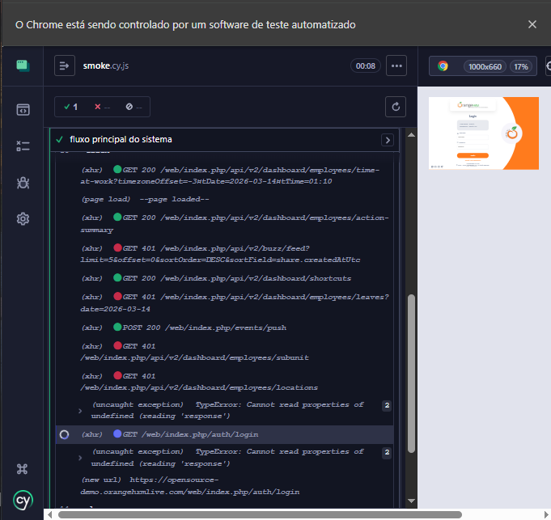

# Bug Report - Logout continua executando requisições para endpoints protegidos retornando 401

### ID:

🐞 BUG-001

----

### Ambiente:

- Aplicação: OrangeHRM Demo
- Navegador: Firefox
- Ferramenta de teste: Cypress
- Sistema operacional: Windows

----

### Descrição:

Após realizar logout na aplicação OrangeHRM, o sistema continua executando chamadas para endpoints protegidos do dashboard.
Como a sessão do usuário já foi encerrada, essas requisições retornam HTTP 401 Unauthorized.

Esse comportamento foi observado durante a execução dos testes automatizados com Cypress.

----

### Passos para reproduzir:

1. Acessar a aplicação OrangeHRM

2. Realizar login com credenciais válidas

3. Acessar o dashboard

4. Clicar no menu do usuário

5. Clicar em Logout

6. Observar as requisições no log do Cypress

----

### Resultado atual:

Requisições retornam **401 Unauthorized** após logout.

----

### Resultado esperado:

O sistema não deve chamar APIs protegidas após logout.

----

### Impacto:

Pode gerar erros no console e indicar falha no controle de sessão,
pois a aplicação continua tentando acessar endpoints protegidos após logout.

----

### Prioridade:

Média 🟠🟠🟠

----

### Evidência

Screenshot capturado durante a execução do teste automatizado:

----

### Observação:

O retorno **401 Unauthorized** é esperado para requisições realizadas sem autenticação válida.  
No entanto, o comportamento observado indica que, após o logout, o frontend continua tentando acessar endpoints protegidos do dashboard.

Isso sugere que algumas chamadas assíncronas ou processos de atualização de dados não estão sendo interrompidos após o encerramento da sessão do usuário.

----

### Root Cause (Possível causa):

Após o logout, o frontend aparentemente continua executando chamadas automáticas do dashboard (como atualização de widgets ou dados do usuário).

Como o token de autenticação já foi invalidado, essas requisições retornam **401 Unauthorized**.

Isso pode indicar que:
- O frontend não cancela chamadas assíncronas após logout
- Componentes do dashboard continuam tentando atualizar dados
- Falta controle de sessão no lado do cliente

----

